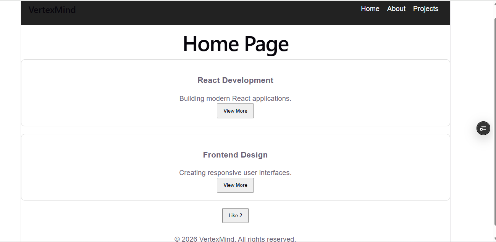
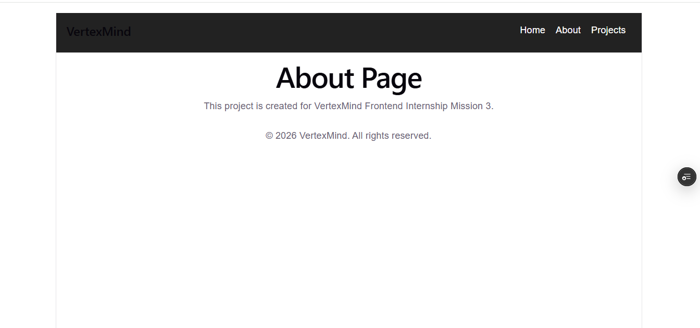
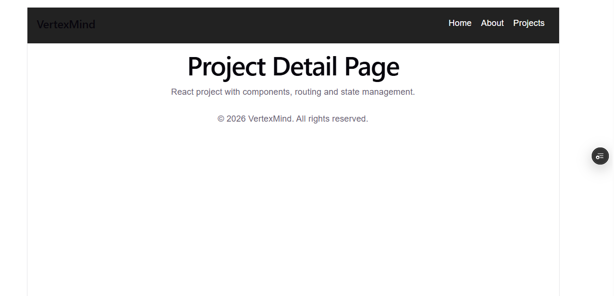

# VertexMind React Frontend Project

## Project Overview:

This project is developed as part of the VertexMind Frontend Internship Mission 3 and Mission 4.

It is a React-based web application built using Vite with reusable components, routing, state management, and Vercel deployment.

## Features:

- React + Vite application
- Reusable React components
  - Navbar
  - Card
  - Footer
- Multiple pages
  - Home
  - About
  - Projects
- Navigation using React Router
- Interactive Like button using useState
- Responsive UI styling
- Deployed using Vercel

## Tech Stack:

- React
- JavaScript
- Vite
- React Router DOM
- CSS
- Git & GitHub
- Vercel

## Setup Instructions:

## 1. Clone the repository:
Download the project from GitHub:
git clone https://github.com/vijaya22356-maker/Week3-VertexMind-React-Task.git

### 2. Open project folder
cd Week3-VertexMind-React-Task

### 3. Install dependencies
npm install

### 4. Start the developmen
npm run dev

## Live Demo:
Vercel URL:
https://week3-vertex-mind-react-task.vercel.app/
npm run dev

## Outcome:

Successfully created and deployed an interactive React application with reusable components, routing, and state management.

## Screenshots

### Home Page

### About Page

### Project Page

## Demo video link using loom:
https://www.loom.com/share/9334154e12c94b27950d2d625c67876d

